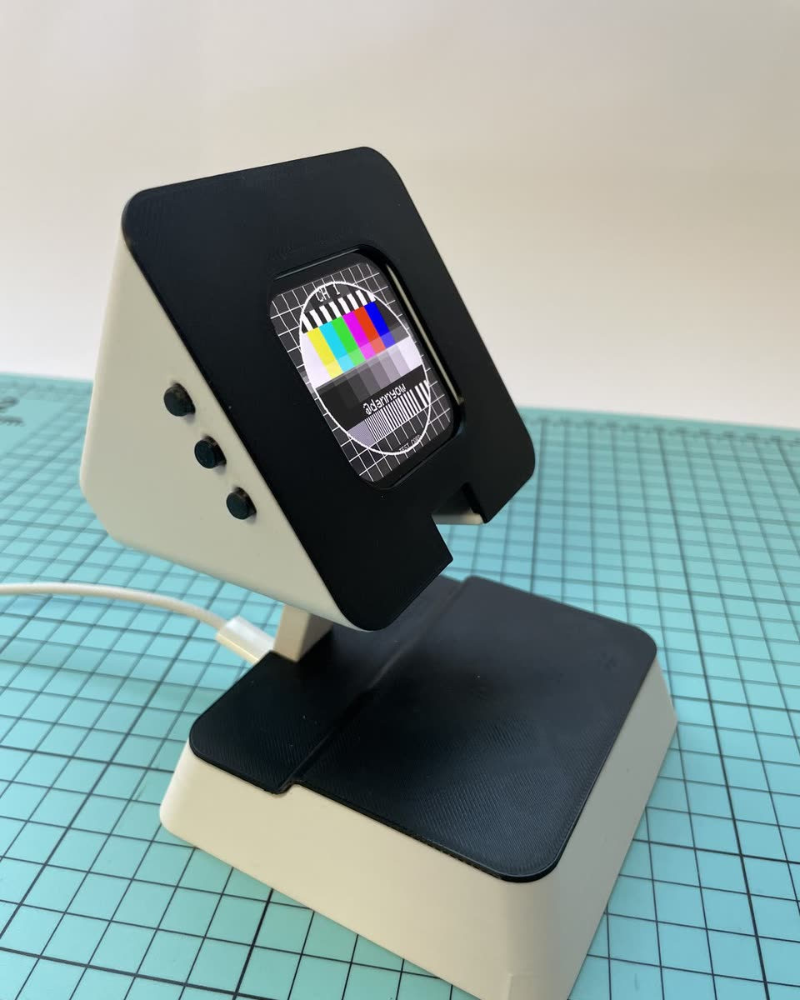
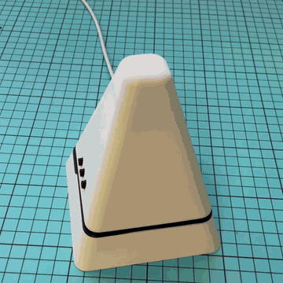
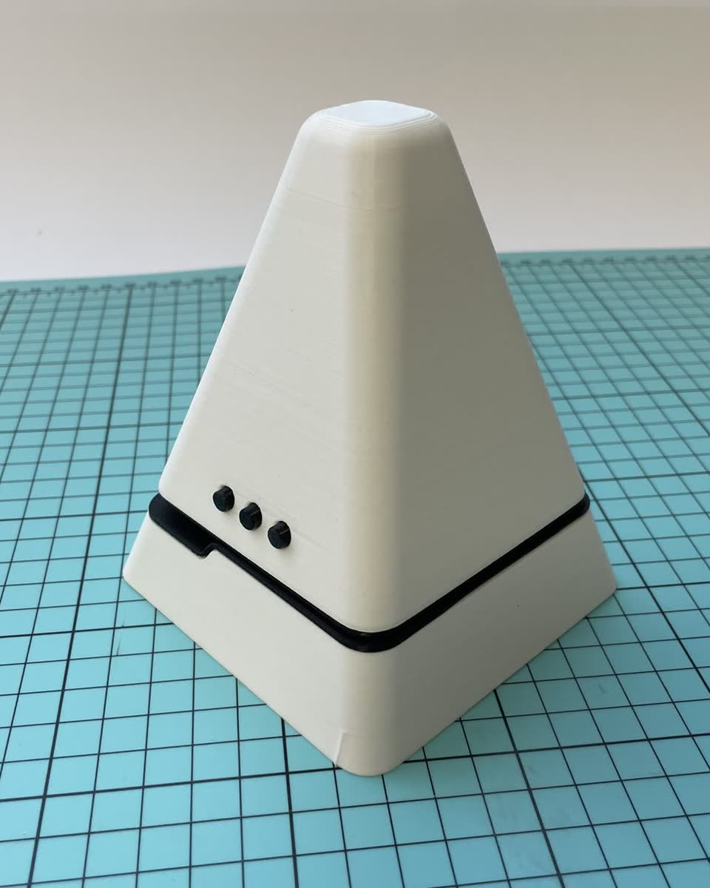
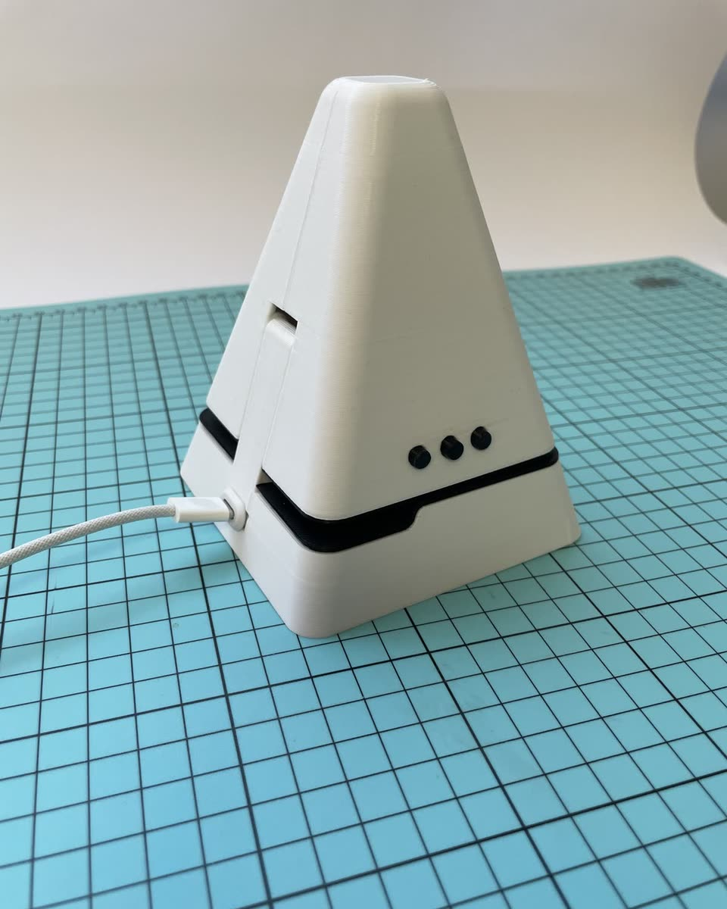
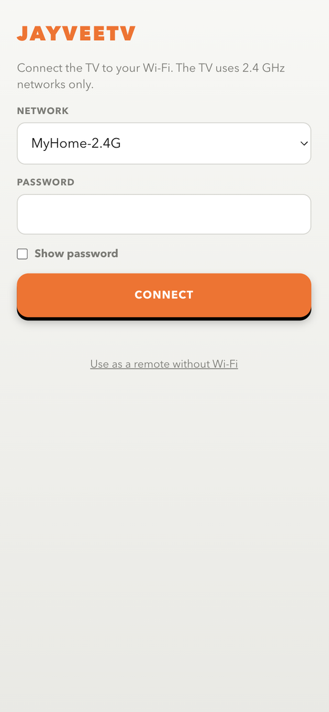
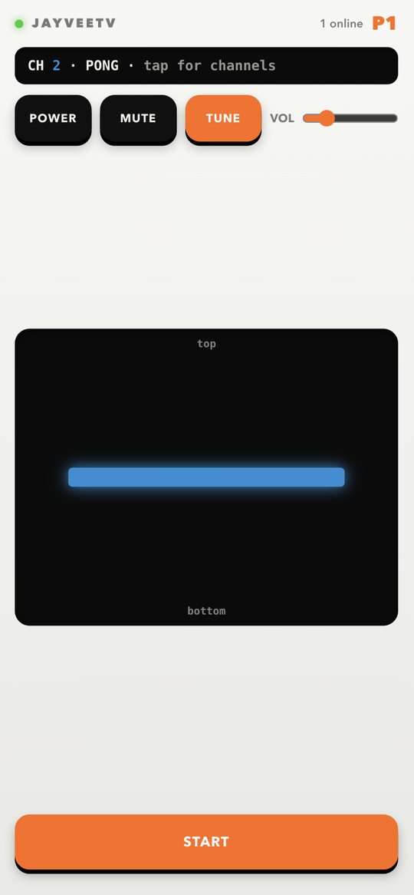
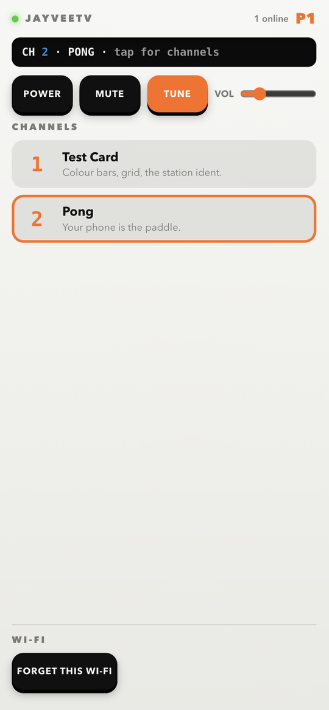
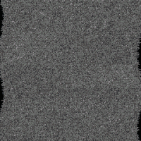
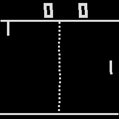

# JayVeeTV

<p align="center"></p>

A desk-size retro television: a Waveshare ESP32-C6 AMOLED module in a 3D-printed
pyramid case, inspired by the JVC 3100R Video Capsule (1975).

It powers on in snow. Knock on the cabinet and it tunes in; leave it and it finds the
picture by itself after 2 s. A hard knock on a good picture knocks it back into snow.
Channels are small programs, and your phone is the remote: the set serves the remote's
web page itself.

<p align="center"></p>

First release: the test card and Pong.

## What you need

- [Waveshare ESP32-C6-Touch-AMOLED-2.16](https://www.waveshare.com/esp32-c6-touch-amoled-2.16.htm)
  (SKU 34202). It has everything the set needs: a 2.16" 480×480 AMOLED, a speaker, an
  accelerometer (for the knock), a real-time clock and three keys.
- A USB-C cable.
- A phone, for the remote.
- Optionally, the printed case (`cad/`, also [on Printables](https://www.printables.com/model/1862118-jayveetv-retro-tv-case-for-the-waveshare-esp32-c6)) and a pair of USB-C power pigtails (a male plug
  for the module, a female socket for the base); see [`cad/README.md`](cad/README.md). The
  pigtails carry power only, so flash the module before you build it into the case. The
  firmware runs on the bare module too.

<p align="center">
  
  
</p>

## Install

**Prebuilt.** Download `jayveetv-<version>-esp32c6-16mb.bin` from the release, then:

```
pip install esptool
esptool.py --chip esp32c6 write_flash 0x0 jayveetv-<version>-esp32c6-16mb.bin
```

The image includes the bootloader and the partition table, so it works on a module that
ran something else before. It also clears any saved Wi-Fi, so the set starts again in its
own network (see First run). Add `--port <port>` if esptool doesn't find the module.

**From source**, with [PlatformIO](https://platformio.org):

```
cd firmware
pio run -e release1 -t upload
```

`tools/release/build-bin.sh` builds the single release image.

## First run

1. Plug it in: snow, then the test card (knock on it to skip the wait).
2. Hold **BOOT** for a second: the **REMOTE** card shows a QR code.
3. Scan it with the phone camera. The phone joins the set's own Wi-Fi (`JayVeeTV-XXXX`) and
   the page opens by itself.
4. Pick your home Wi-Fi (2.4 GHz) and type its password. The set joins it and shows a new
   QR code: put the phone back on your Wi-Fi and scan that one. From then on the remote is
   at `http://jayveetv.local/`.

   No router around? "Use as a remote without Wi-Fi" on that page plays Pong on the set's
   own network.

Details, and how to make the set forget a network: [`docs/NETWORK.md`](docs/NETWORK.md).

## The remote

Open the page on your phone and it works as the remote. There is nothing to install.

<p align="center">
  
  
  
</p>

- On the set's own Wi-Fi the page opens on the setup screen: pick your network and type
  its password.
- The remote has power, mute, next channel and volume at the top, and below them whatever
  the current channel needs. Pong gets a paddle slider and START; the test card needs
  nothing.
- Tap the strip at the top to see the channel list and jump to any channel.

Up to two phones at once (players 1 and 2). The phone also sets the set's clock. How the
page talks to the set: [`docs/REMOTE.md`](docs/REMOTE.md).

## Controls

| on the set | does |
|---|---|
| knock on the cabinet | tunes a snowy picture in; a hard knock knocks a good one out |
| **KEY** (back of the module) | next channel (in a game: its A button; hold it to change channel) |
| **BOOT** key | mute (in a game: its B button); hold for the REMOTE card |
| **PWR** key | power |
| face down / face up | off / on |

## Channels

| | channel | |
|---|---|---|
|  | **1 · Test Card** | colour bars, grid, clock, a 1 kHz tone near lock |
|  | **2 · Pong** | 1970s TV tennis, one or two phones as paddles |

A channel is one folder in `firmware/channels/`. The platform does the rest: snow, tuning,
the picture tube and the sound of an old set. How to write one: [`docs/CHANNELS.md`](docs/CHANNELS.md).

### Write a channel with an LLM

Channels are designed to be written by a coding agent. The contract is in
`docs/CHANNELS.md` and the working rules are in [`AGENTS.md`](AGENTS.md), which Claude
Code, Codex and most other agents read on their own. `tools/hostrender` checks the result
on your computer. We tested this prompt with three different models, and each wrote a
playable Breakout:

> Write a Breakout channel for JayVeeTV. Paddle on the phone's slider, START serves the
> ball, three lives, a score. Follow AGENTS.md and verify it with the host check.

Then flash, tune to the new station and play.

## In this repository

- `firmware/`: the PlatformIO project. `platform/` holds the tuner, CRT, glitch layer,
  sound, input and network; `channels/` has one folder per channel.
- `docs/`: architecture, writing a channel, the remote protocol, the network setup.
- `cad/`: the case as STL files, with print and assembly notes (CC BY-SA 4.0).
- `tools/`: the host renderer, the phone page source, the release build, git hooks.

## Known issues

- The test card sometimes drops from about 13 to 9 fps around 90 s after boot. It only
  affects smoothness.
- The Wi-Fi password is stored unencrypted on the module.
- The clock follows daylight saving only when a phone visits (the phone supplies the
  timezone offset).

## Licences
Code: MIT (`LICENSE`). Printable parts in `cad/`: CC BY-SA 4.0 (`cad/LICENSE.md`).
Third-party code and content keep their own licences, listed in `THIRD_PARTY.md`.
JVC is a trademark of JVCKENWOOD Corporation; this project is not affiliated with it.
