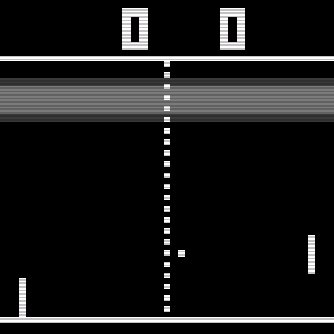

# Pong

A 1979 TV-game-console tennis, TVG-10 / AY-3-8500 flavour: white blocks on
black, a dashed net, blocky 3×5 score digits, a square ball. First to 11.

## What it is

`CH_GAME`: the set's physical keys become yours (KEY/IO10 = `IN_A`, BOOT =
`IN_B`; a long KEY press still tunes away). `CH_ENDLESS`: a game never
drifts off on its own.

Paddle/wall hits and points play a short tone through `sound()` (440 Hz /
40 ms for a hit, 220 Hz / 250 ms for a point): the channel owns its own
"how long has it been since the hit" timer and just tells the platform
whether it wants a tone *this frame*; the platform mixes it over the set's
own hiss/hum bed.

## Controls

- **Knob (slider)**: absolute paddle position.
- Physical keys, or the phone's d-pad/A-B if a future panel adds one:
  `UP`/`DOWN` (or `A`/`B`) move the paddle; whichever the phone last touched
  (knob vs. keys) wins for that player.
- **START**: restart the match (any time).

Two phones = two players. With only one connected, the right paddle is a
CPU (beatable) after 5 s of player-1 silence.

## Credits

Original design and code: this project, in the spirit of the 1970s
dedicated tennis consoles (Ameprod TVG-10 / General Instrument AY-3-8500);
no code or assets taken from either.
